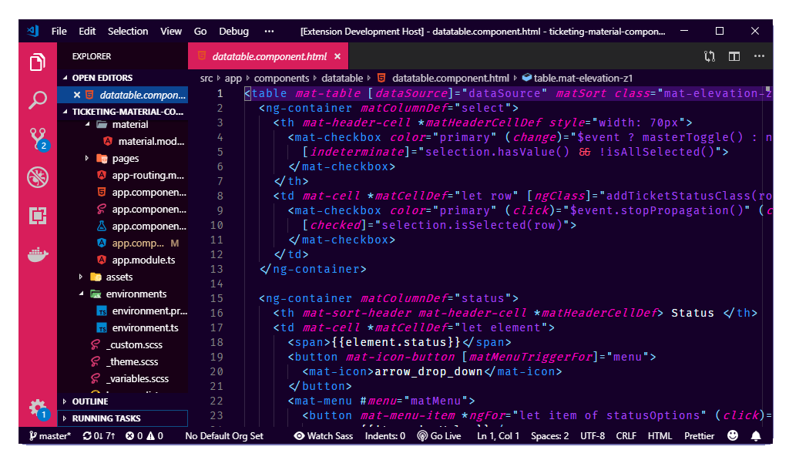
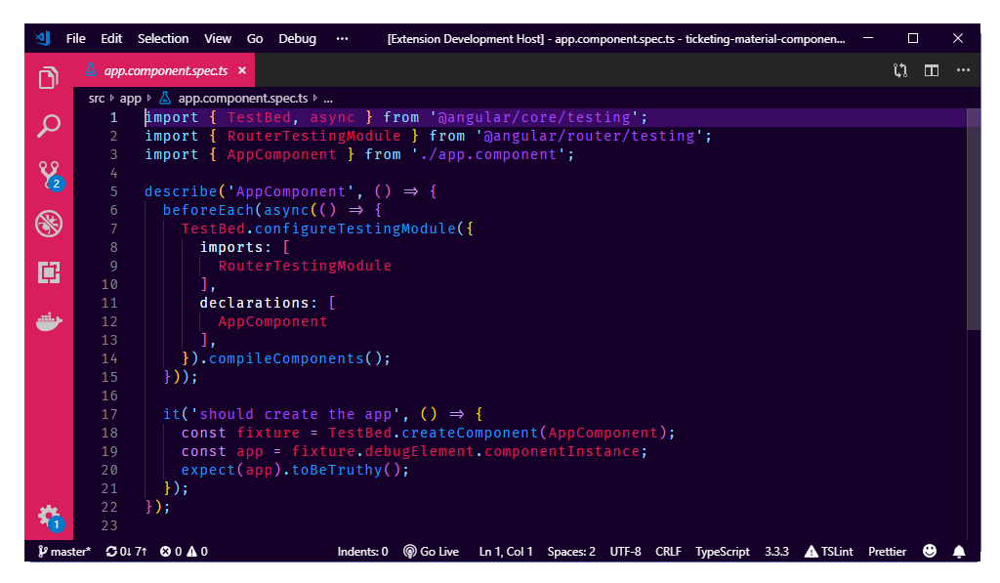
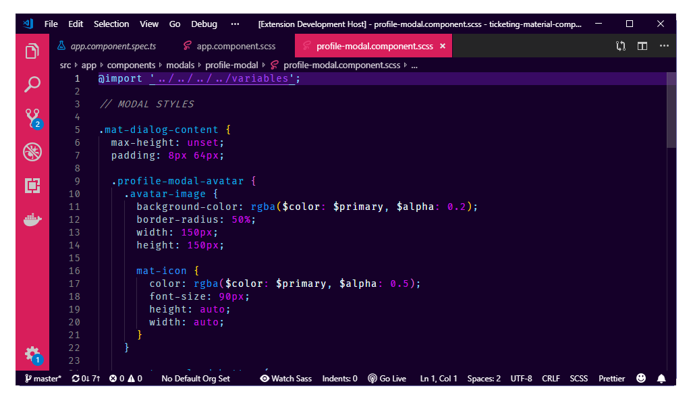

# Girl, Do you like Unicorn?


Do you even Code Girl? This is a special theme for all those lovely girl coders out there. Stay awesome and code like a unicorn.

## Screenshots







## How to Install

1. Open **Extensions** sidebar panel in Visual Studio Code. `View → Extensions`
1. Search for `Girl, Do you like Unicorn?`
1. Click **Install**
1. Click **Set Color Theme**
1. Optional: Use the recommended settings below for best experience

## Recommended Settings

```json
{
  "editor.fontFamily": "Fira Code",
  "editor.fontLigatures": true,
  "editor.formatOnPaste": true,
  "editor.formatOnType": false,
  "editor.formatOnSave": true,
  "editor.letterSpacing": 0.5,
  "editor.lineHeight": 25,
  "zenMode.centerLayout": false
}
```

**Enjoy!**
